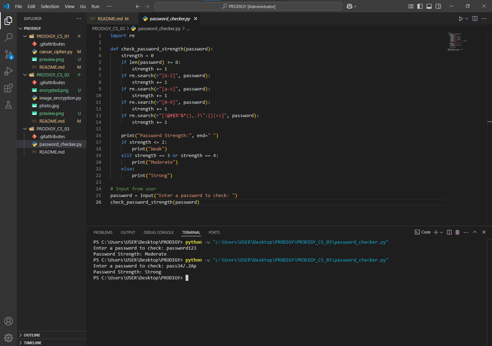

## PRODIGY INFOTECH CYBERSECURITY INTERNSHIP ##
# Task 3: Password Strength Checker

This Python tool checks the strength of a user-entered password based on its length, use of uppercase/lowercase letters, numbers, and special characters. It gives feedback whether the password is weak, moderate, or strong.

## 🔧 Features
- Checks password for:
  - Length
  - Uppercase & lowercase letters
  - Digits
  - Special characters
- Displays strength result

## ▶️ How to Run
1. Run `password_checker.py`.
2. Enter a password when prompted.
3. View the strength result in the terminal.

## 📸 Preview

---
